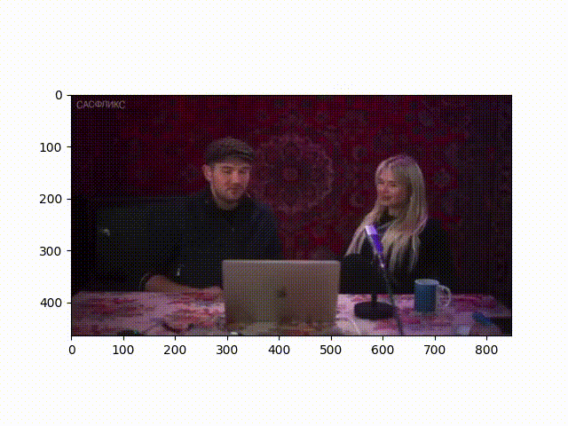
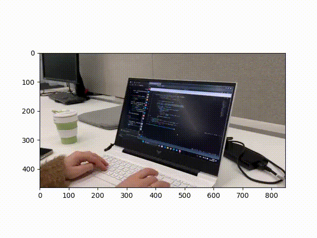

# Overview
This is the repository of LLaVa-NeXT(original repo: https://github.com/LLaVA-VL/LLaVA-NeXT) fine tuning (with QLoRA (https://github.com/artidoro/qlora) or LoRA (https://arxiv.org/abs/2106.09685)) for detailed summary generation.
I used only "mixkit"-22.2G, and "pexels"-14.3G part of Dataset (cut for approximately 10G total), because Full dataset is 40k videos.


# Project Organization
------------
```
Project
├── notebook # here are files for testing
│   └── LLaVa_NeXT_FT_logic.ipynb # for testing of code and inference
├── test_videos # here are files for testing
│   ├── video_test.mp4
│   ├── video_test_2.mp4
│   └── video_test_3.mp4
├── model_ft # storage for fine-tuned model (cache). This folder will be created after run.
│   ├── ...
│   └── ...
├── dataset # folder where dataset is loaded. This folder will be created after run.
│   ├── ...
│   └── ...
├── cache_processor # folder with processor (cache). This folder will be created after run.
│   ├── ...
│   └── ...
├── results # folder with model's result
│   ├── video_test.mp4
│   ├── video_test_2.mp4
│   └── video_test_3.mp4
├── utils # folder for additional code like preprocessing and load video function
│   └── utils.py
├── run_ft.py # main logic for fine tuning
├── requirements.txt # file with requirements
├── run.sh # script for run fine-tuning to be run in TMUX
└── README.md
```

# Description of Project
The Idea is to fine tune LLaVa for generating the described summaries and for that ShareGPT4Video dataset was used (https://sharegpt4video.github.io/)


# How to run
## Setup an environment 
```bash
python3 -m venv venv
source venv/bin/activate
```
in virtual environment
```bash
(venv) pip install -r requirements.txt
```

if not enough memory for storing packages in main folder (especially for servers)
This code will store all cache in local `.cache` folder in current folder and can be easily deleted later
```bash
TMPDIR=.cache/ pip install -U --cache-dir=$TMPDIR numba transformers accelerate ...
```

## Command to start fine tuning
```bash
chmod 777 -x ./run.sh
(venv) ./run.sh
```
After fine tuning model will be pushed to the hub


# Resulting model
After fine tuning with QLoRA and some hyperparameter tuning model is pretty good with generation of detailed summaries for even custom videos.
Final model with adapters can be found in huggingface: https://huggingface.co/sm47466863/LLaVa-NeXT-Video-GENAI-FT-Project
Or can be loaded directly:
```Python
# Load model directly
from transformers import AutoModel
model = AutoModel.from_pretrained("sm47466863/LLaVa-NeXT-Video-GENAI-FT-Project")
```


# Results

Caption vanilla: 'USER:  <video> \nProvide a summary for this video. ASSISTANT: The video features two individuals sitting close together, engaged in conversation and laughing. One is wearing a hat and seems to be the focus of attention, while the other is facing away from them, sitting behind the person in the hat. The scene includes a laptop and some decorative furnishings, with lighting that highlights their expressions and creates a warm and cozy atmosphere. The nature of their interaction, body language, and the setting suggest they are perhaps a couple or close friends sharing a pleasant interaction.'
Caption FT: "USER:  <video> \nProvide a summary for this video. ASSISTANT: The video showcases a man and a woman engaged in a casual conversation, specifically discussing elements related to a product or topic of interest, facilitated by a laptop placed on a table, with the man using a microphone. The setup appears to be a typical recording or production studio setup, featuring sound equipment such as microphones and a laptop connected to headphones, which is being used to control the recording process. The man wears a hat, likely representing his persona or style, and he speaks in an animated and engaged manner, suggesting enthusiasm for the discussion. The woman responds to his conversation, offering her perspectives or questions.\n\nBetween moments of engagement, both individuals appear to be checking their phone discreetly, possibly indicating a pause in the conversation or a change in the discussion. As the video progresses, the man continues to engage with the woman, sharing more information or insights relevant to the topic at hand, and she listens attentively. The man remains seated throughout the conversation, while the woman may appear to be reclining or relaxed.\n"

Caption vanilla:'USER:  <video> \nProvide a summary for this video. ASSISTANT: The video shows a person sitting at a workstation with a laptop and keyboard in front of them. The person is typing quickly on the laptop and seems focused on the task. There is a computer monitor nearby, displaying a desktop with various open windows that appear to be applications or documents being worked on. A chair is visible behind the person, positioned at a 90-degree angle suggesting the viewer is sitting on it and facing the laptop.'
Caption FT:"USER:  <video> \nProvide a summary for this video. ASSISTANT: The video captures a scene of a person working on a laptop in an office-like setting, with the focus on the task of writing or typing on a document, followed by a transition to a different document on the same screen. A series of close-up shots and long views of the laptop and the individual's movements are shown as the person interacts with the device. These include typing or writing text, adjusting the screen angle, and occasional glimpses of the person's face and the surrounding environment. The sequence of actions appears to emphasize the individual's interaction with technology and their engagement with the digital space, highlighting the process of composing or editing text, reflecting a commonplace work environment likely involving tasks such as drafting, revising, or data entry. Throughout, the surroundings remain consistent, suggesting no significant variation or change in setting, but the specific activity or details on the screen suggest a progression of work."

Caption vanilla:'USER:  <video> \nProvide a summary for this video. ASSISTANT: This video features a musical performance in a subway setting. The musicians are playing instruments in a subway station, creating a unique and intimate atmosphere. The performers are arranged on the platform area, inviting the audience to join them or simply provide a serene musical interlude for subway passengers. One person plays a violin, captivating and delicate in its sound, while another plays the cello, adding a deep, resonant base to the musical progression. Their playing captures the passersby and subway passengers, filling their trip with moments of harmony and expression. The musicians share smiles and interactions with their audience, engaging both individuals in their performance and the environment. The station platform becomes their stage, offering a public space for music-loving travelers to enjoy and share a musical moment.'
Caption FT:"USER:  <video> \nProvide a summary for this video. ASSISTANT: The video captures a spontaneous moment of two musicians performing in an urban environment, where an underground subway station or transit area serves as their stage. The musicians, a cellist and a flautist, share a talent and a passion for playing their instruments in public spaces, blending seamlessly into the rhythm of city life. The cellist, positioned on the left side of the frame, is actively strumming their instrument while exuding a tranquil, focused expression. Meanwhile, the flautist stands on the right, leaning in with a dynamic posture as they play, their body leaning forward as if bending over their instrument to play with full concentration and engagement.\n\nThe setting's ambient lighting and the visible architecture create a scene in stark contrast to the traditional concert space, creating an intimate atmosphere that transforms the public into a makeshift audience. Despite the absence of seating, individuals are seen taking a moment to pause from their own activities to appreciate the impromptu performance. A group of two people are spotted towards the center"